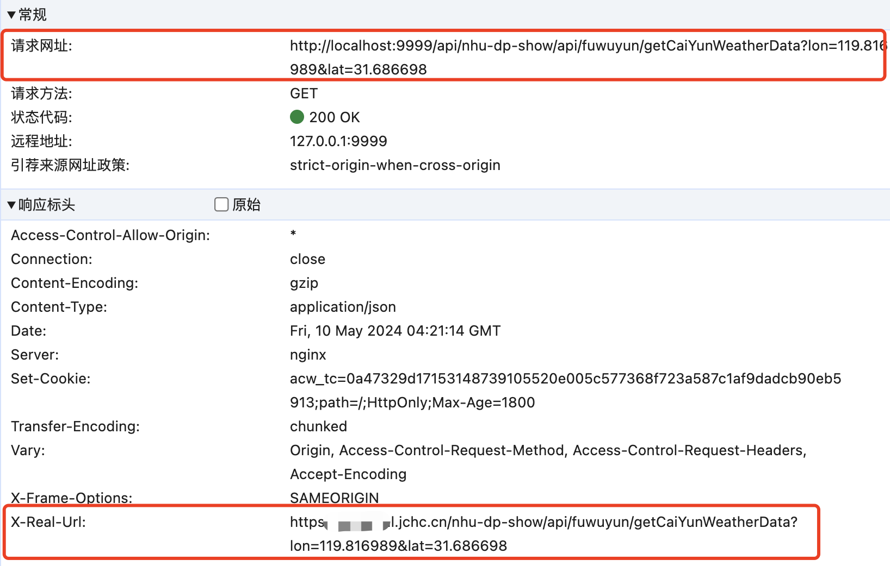
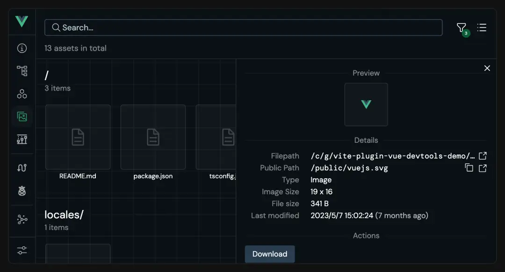
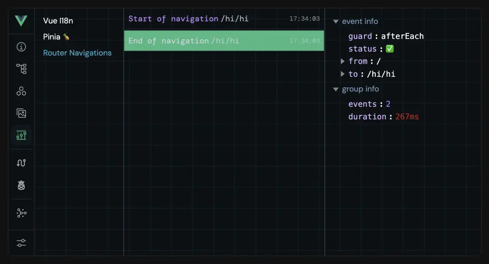
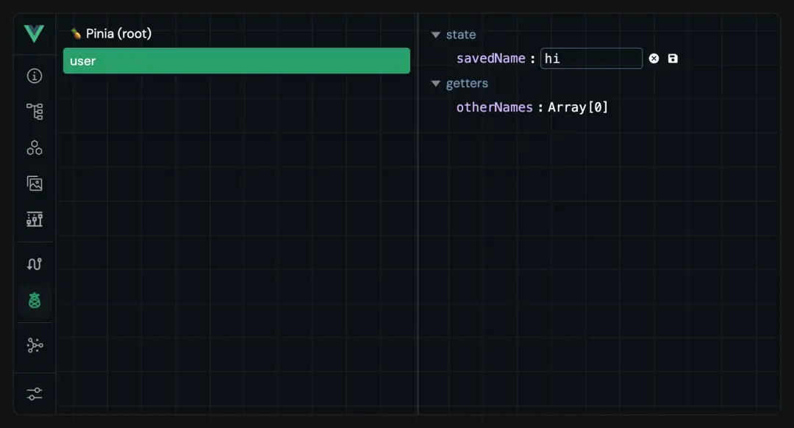
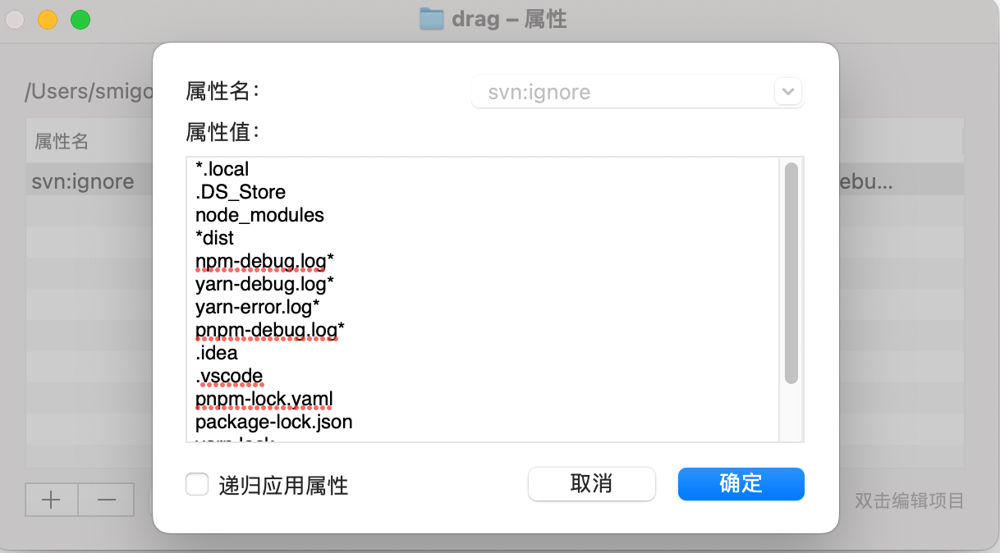
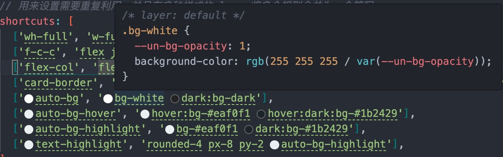

<div align="center">
  
  <h1>Mirovideo Vue3 Vite Base</h1>
</div>

## 简介

Mirovideo Vue3 Vite Base

- ⚡️ 使用 **Vite** ，ES驱动的前端开发与构建工具，实现真正的按需编译，即时更新。并获得更小的打包体积。
- 🆒 使用 **Vue3** 主流最新技术栈: `Vite + Vue3 + Pinia`
- 🐜 从 _ant-design-vue 3.x_ 版本升级到 **ant-design-vue 4.x** 版本，4.0+ 版本更新了*Flex* 弹性布局、*QRCode*二维码、_Watermark_ 水印、_Statistic_ 统计数值、_Tour_ 漫游式引导等全新组件。
- 🧪 ~~🧪~~~~ 使用 ~~~~**原子 CSS**~~~~ 框架: ~~`~~Unocss~~`~~，优雅、轻量、易用~~
- 🍍 集成 **Pinia** 状态管理，支持状态持久化
- 📦 配合 **pnpm** 包管理器，提高效率
- ✈️ 使用 **unplugin** 系列自动导入工具`unplugin-auto-imports`、`unplugin-vue-components`
- 🔧 开发环境配置 **VueDevTools** 调试工具
- 📖 配置 **Eslint** 语法检查、**Prettier** 格式统一插件

<h3 id="Nj8Sg">速度提升</h3>
1、由于搭配使用了`Vite<font style="color:rgb(51, 51, 51);">，加上推荐使用的</font>pnpm包管理器，可以使我们的优化我们安装依赖，加载，打包的速度。绝大多数情况pnpm<font style="color:rgb(25, 25, 25);">速度会比</font><font style="color:rgb(25, 25, 25);"> npm / yarn</font><font style="color:rgb(25, 25, 25);"> 快 2-3 倍。</font>

<font style="color:rgb(25, 25, 25);">2、另外优化了</font>`unplugin-auto-imports`、`unplugin-vue-components`的<font style="color:rgb(25, 25, 25);">自动引入、将基础方法库、pinia 都自动引入，简化了部分开发功能，能够提高我们的开发效率。</font>

<font style="color:rgb(25, 25, 25);">3、Vue3.5 升级</font>

<h3 id="zbMpX">Vue 版本升级</h3>
color1
2024年9月4日 VUE 发布了 <font style="color:#DF2A3F;">3.5</font> 的正式版本<font style="color:#585A5A;">版本号：天元突破-红莲螺岩</font>

由于<font style="color:rgb(77, 77, 77);">这一小版本发布没有破坏性更改，但是包括内部改进和一些有用的新特性</font><font style="color:rgb(25, 27, 31);">，</font>本框架于 9.5 日也去尝试使用，并最终决定在集成在本框架中。

下面简单介绍一下 3.5 版本的具体更新：

<h4 id="hHpSl">1、响应式系统优化升级</h4>
用户无感，<font style="color:rgb(51, 51, 51);">重构后内存占用减少56%，大数组操作将快10倍速度（官方数据）。</font>

<h4 id="TLaac"><font style="color:rgb(51, 51, 51);">2、响应式</font><font style="color:rgb(51, 51, 51);"> </font><font style="color:#DF2A3F;">Props</font><font style="color:rgb(51, 51, 51);"> </font><font style="color:rgb(51, 51, 51);">结构</font></h4>
<font style="color:rgb(51, 51, 51);">以前 Props 解构后就会丢失响应式，但是 Vue3.5 支持 Props 响应式解构了。</font>

```vue
const { foo } = defineProps(['foo']) // 且具有响应式 watchEffect(() => { //
在3.5版本之前这里只会运行一次 // 当3.5中的“foo”属性发生变化时重新运行 console.log(foo) })
```

<h4 id="kYNpC">3、<font style="color:#DF2A3F;"> watch </font><font style="color:rgb(79, 79, 79);">更新</font></h4>
<h5 id="Sioos"><font style="color:#000000;">deep</font><font style="color:rgb(79, 79, 79);"> 支持设置层级</font></h5>
<font style="color:rgb(51, 51, 51);">在以前deep选项的值要么是false，要么是true，表明是否深度监听一个对象。在 3.5 中deep选项支持传入数字了，表明监控对象的深度。</font>

```vue
<template>
  <div>
    <button @click="change">change</button>
  </div>
</template>
<script setup>
let obj = ref({
  a: {
    n1: 0,
    b: {
      n2: 0,
      c: {
        n3: 0,
        d: {
          n4: 0,
          e: {
            n5: 0,
          },
        },
      },
    },
  },
})
watch(
  obj,
  (val) => {
    console.log(val)
  },
  {
    deep: 2,
  },
)

const change = () => {
  obj.value.a = {
    q: 0,
  }
}
</script>
```

<h5 id="Bl7qi">新增onWatcherCleanup参数</h5>
<font style="color:rgb(77, 77, 77);">这个 api 优化 watch 监听</font>  
<font style="color:rgb(51, 51, 51);">在组件卸载之前或者下一次</font><font style="color:#74B602;">watch</font><font style="color:rgb(51, 51, 51);">回调执行之前会自动调用</font><font style="color:#74B602;">onWatcherCleanup</font><font style="color:rgb(51, 51, 51);">函数，同样有了这个函数后你就不需要在组件的</font><font style="color:#74B602;">beforeUnmount</font><font style="color:rgb(51, 51, 51);">钩子函数去统一清理一些</font><font style="color:#74B602;">timer</font><font style="color:rgb(51, 51, 51);">了。比如下面这个场景：</font>

```vue
watch(flag, () => { const timer = setInterval(() => { // 做一些事情 console.log("do something"); },
200); onWatcherCleanup(() => { console.log("清理定时器"); clearInterval(timer); }); });
```

<font style="color:rgb(77, 77, 77);">vue 3.4 中 watch 配置中还新增一个 once 属性，只监听一次数据变化</font>

```javascript
watch(
  obj,
  (val) => {
    console.log(val)
  },
  {
    deep: 2,
    once: true,
  },
)
```

<h4 id="lNM2c"><font style="color:rgb(77, 77, 77);">4、新增</font><font style="color:rgb(199, 37, 78);background-color:rgb(249, 242, 244);">useTemplateRef</font><font style="color:rgb(77, 77, 77);">函数</font></h4>
<font style="color:rgb(77, 77, 77);">之前的使用方式</font>

```vue
<input value="" ref="inputDom" />
// 获取dom const inputDom = ref(null) inputDom.value.focus()
```

<font style="color:rgb(77, 77, 77);">因为一般 ref 用于绑定变量，会让开发者比较迷惑， 所以 3.5 新增了</font><font style="color:rgb(62, 175, 124);">useTemplateRef 函数</font>

```vue
<input value="" ref="inputRef" />
// 获取dom const inputDom = useTemplateRef('inputRef') inputDom.value.focus()
```

<font style="color:rgb(51, 51, 51);">使用</font><font style="color:rgb(62, 175, 124);">useTemplateRef</font><font style="color:rgb(51, 51, 51);">函数后会返回一个 ref 变量，</font><font style="color:rgb(62, 175, 124);">useTemplateRef</font><font style="color:rgb(51, 51, 51);">函数传的参数是字符串</font><font style="color:rgb(62, 175, 124);">"inputRef"</font><font style="color:rgb(51, 51, 51);"></font>

<h4 id="aa83fef7"><font style="color:rgb(79, 79, 79);">5、Teleport 传送组件</font></h4>
<font style="color:rgb(62, 175, 124);">Teleport</font><font style="color:rgb(51, 51, 51);">组件的作用是将children中的内容传送到指定的位置去，比如下面的代码：</font>

```vue
<div id="target"></div>
<Teleport to="#target">被传送的内容</Teleport>
```

<font style="color:rgb(51, 51, 51);">文案</font><font style="color:rgb(62, 175, 124);">被传送的内容</font><font style="color:rgb(51, 51, 51);">最终会渲染在</font><font style="color:rgb(62, 175, 124);">id="target"</font><font style="color:rgb(51, 51, 51);">的 div 元素中。</font>

<font style="color:rgb(51, 51, 51);">在之前有个限制，就是不能将</font><font style="color:rgb(62, 175, 124);"><div id="target"></font><font style="color:rgb(51, 51, 51);">放在</font><font style="color:rgb(62, 175, 124);">Teleport</font><font style="color:rgb(51, 51, 51);">组件的后面。</font>

<font style="color:rgb(51, 51, 51);">在 3.5 中为了解决这个问题，在</font><font style="color:rgb(62, 175, 124);">Teleport</font><font style="color:rgb(51, 51, 51);">组件上新增了一个</font><font style="color:rgb(62, 175, 124);">defer</font><font style="color:rgb(51, 51, 51);">延迟属性。</font>

<font style="color:rgb(51, 51, 51);">加了</font><font style="color:rgb(62, 175, 124);">defer</font><font style="color:rgb(51, 51, 51);">延迟属性后就能将</font><font style="color:rgb(62, 175, 124);">target</font><font style="color:rgb(51, 51, 51);">写在</font><font style="color:rgb(62, 175, 124);">Teleport</font><font style="color:rgb(51, 51, 51);">组件的后面，代码如下：</font>

```vue
<Teleport defer to="#target">被传送的内容</Teleport>
<div id="target"></div>
```

<h2 id="V9L3K">使用方法</h2>
<h3 id="Ki81Z">环境要求</h3>
由于建议新一代pnpm包管理器，`package.json中已经使用engines将node版本指定为：

其中 pnpm（建议使用淘宝源）

```javascript
"node": ">=18 <=20",
"pnpm": ">=8 <=9"
```

<h3 id="QUdGq">下载脚手架</h3>
（git地址待更新）

svn 地址

<h3 id="urs1w">安装依赖</h3>

```
pnpm i
```

或者

```
pnpm add
```

### 运行项目

1.开发环境

```
npm run dev
```

或者

```
pnpm run dev
```

2.测试环境

```
npm run dev:test
```

或者

```
pnpm run dev:test
```

3.生产环境

```
npm run dev:pro
```

或者

```
pnpm run dev:pro
```

### 打包项目

在 `vite.config.js` 中配置了打包输出文件夹名 `VITE_TITLE + '-' + viteEnv.VITE_MODE + '-dist'` ,会生成以下项目名：
**当前项目名-当前环境-dist**
可自行修改

1.打包生产环境

```

npm run build
```

或者

```
pnpm run build

```

2.打包测试环境

```
npm run build:test
```

或者

```
pnpm run build:test
```

### 预览打包项目

启动一个本地的静态文件服务器，用于预览打包项目。这个服务器通常用来模拟生产环境的行为，帮助开发者测试构建后的应用程序。

```
npm run preview
```

或者

```
pnpm run preview
```

### 自动修复

可以自动修复 `.js` , `.vue` 文件中 `Eslint` 的格式错误

```
npm run lint:fix
```

或者

```
pnpm run lint:fix
```

## 文件目录

```

├── node_modules                                       # 安装后生成的依赖文件夹
├── public                                             # 静态资源
│   └──favicon.ico                                     # favicon图标
├── scaffold-config                                    # 脚手架的相关配置文件夹
│   │── .eslint-global-variables.json                  # AutoImport会生成eslint的自动引入extends文件
│   │── auto-imports.d.ts                              # unplugin-auto-import自动生成引入文件
│   └── components.d.ts                                # unplugin-vue-components自动生成引入文件
├── src                                                # 源代码文件夹
│   ├── api                                            # 所有请求（要求按业务分文件夹）
│   ├── assets                                         # 静态资源
│   │   │── styles                                     # 样式文件（要求按公共/业务分文件夹）
│   │   │── images                                     # 图片文件（要求按公共/业务分文件夹）
│   │   └── icons                                      # svg图标文件
│   ├── config                                         # 全局配置
│   │ │── custom-config.js                              # 用户自定义配置文件
│   │ │── default-config.js                             # 默认配置文件（network、setting、theme等）
│   │ └── index.js                                     # 主题配置
│   ├── components                                     # 组件
│   │   │── base-components                            # 框架全局组件文件夹
│   │   │   └── svg-icon                               # svg图标组件
│   │   └── business-components                        # 业务组件文件夹
│   ├── core                                           # 项目核心相关文件夹
│   │   │── lazy-use.js                                 # 按需加载配置
│   │   └── request.js                                 # 请求配置
│   ├── router                                         # 路由
│   │   │── basic-routes.js                            # 基础路由、静态路由
│   │   │── index.js                                   # 路由入口文件
│   │   └── permission.js                              # 路由守卫
│   ├── store                                          # Pinia状态管理文件夹
│   │   │── modules                                    # Pinia状态文件（分模块）
│   │   └── index.js                                   # Pinia入口文件
│   ├── utils                                          # 工具类（需要调整）
│   ├── views                                          # views 所有页面（按业务分文件夹）
│   ├── App.vue                                        # vue入口页面
│   └── main.js                                        # js入口文件 加载组件 初始化等
├── .env                                               # 全局默认配置文件，无论什么环境都会加载合并
├── .env.development                                   # 开发环境变量配置
├── .env.production                                    # 生产环境变量配置
├── .env.test                                          # 测试环境变量配置
├── .eslintignore                                      # eslint忽略文件
├── .eslintrc.js                                       # eslint 配置项
├── .gitignore                                         # git忽略文件（svn无法自动识别忽略文件，手动引入该文件）
├── .prettierignore                                    # prettier忽略文件
├── .prettierrc.json                                   # prettier 配置项
├── index.html                                         # html模板
├── jsconfig.json                                      # js 配置项
├── package.json                                       # package.json
├── pnpm-lock.yaml                                     # package安装依赖后生成文件
├── README.md                                          # 项目说明
└── vite.config.js                                     # vite脚手架配置文件

```

与之前`webpack`版本脚手架略有不同地方

1、入口`index.html`在文件根目录（vite脚手架的特性）

2、其中`scaffold-config`放置一些脚手架的相关配置文件夹

3、`config`文件夹只区分系统配置（`default-config.js  ）和用户配置（`custom-config.js）

4、`permission`放在了router内部，用于做路由拦截

5、`@/utils/auto-import`下的js文件在`vit.config.js`中制作了全局`auto import`配置

## 环境变量

分为`.env`、全局环境文件，目前配置`VITE_TITLE`，入口`index.html`文件由此参数配置
其他分环境文件：

- `.env.development`-开发环境
- `.env.production`-生产环境
- `.env.test`-测试环境

已结合`/core/request.js`中配置了基础服务`VITE_APP_BASE_API`参数
并在`vite.config.js`中配置反向代理
如果需要 _多服务_ ，可以自行添加结合`/core/request.js`配置其他服务

在反向代理，响应头中添加`x-real-url`配置，可以查看当前 **请求的真实地址**


## Microvideo request

文档地址：

src/core/request.js 请求配置

```
import { createRequest } from 'microvideo-request'

/**
  * 实例1：一般请求
  * 单个服务配置时 createRequest()可为空
  * */
getList (params) {
  return createRequest().setParameters(params).get('/event/list')
}
/**
  * 实例2：多服务请求
  * SEVER_NAME 是在 request.js 里配置的服务名，通过不同的服务名请求不同的服务
  * */
getList (params) {
  return createRequest('SEVER_NAME').setParameters(params).get('/event/list')
}

/**
  * 实例3
  * 用setAxios请求
  * 传参方法遵循 axios
  * */
getList (params) {
  return createRequest().setAxios({
    url: '/event/listForJtqg',
    method: 'get',
    params
  })
}
```
对于 `blob` 文件流类型，在`request.js`中配置了`config.responseType==='blob`的判断，在返回值中会自动返回文件流，无需再手动处理
使用示范

- `file()` 下载文件流

  ```
  createRequest().setParameters(object).file(url, config)
  ```

**config [Object] 配置**
| config   | 类型   | 说明         |
| -------- | ------ | ------------ |
| fileType | String | 下载文件类型 |
| fileName | String | 下载文件名   |

关于 fileType 文件类型，可取值：

| 拓展名       | 文件类型             | fileType                      |
| ------------ | -------------------- | ----------------------------- |
| .jpg 、.jpeg | JPEG 图片            | image/jpeg                    |
| .png         | PNG 图片             | image/png                     |
| .json        | JSON 格式            | application/json              |
| .pdf         | PDF                  | application/pdf               |
| .ppt         | Microsoft PowerPoint | application/vnd.ms-powerpoint |
| .xls         | Microsoft Excel      | application/vnd.ms-excel      |
| .zip         | ZIP                  | application/zip               |
| .rar         | RAR 存档             | application/x-rar-compressed   |

- `fileUrl()` 获取 url 链接

```
createRequest().setParameters(object).fileUrl(url, openUrl)
```

**openUrl [Boolean] 是否打开 url 默认为 true**

为 true 时，会直接通过 window.open(href) 打开连接
为 false 时，可以通过 then 回调获取 url

或者`fileType`指定blob，`fileName: '文件名.xlsx'`中指定文件类型后缀
如：
```
createRequest('服务名').file('/url', {
  fileType: 'blob',
  fileName: '文件名.xlsx',
  method: 'get'
})
```
如若是图片类型，不限制文件类型，可以通过地址直接打开
如：
```
createRequest('服务名').fileUrl('/url', true)
```

## 路由

1. 路由入口文件 `src/router/index.js`
   使用 `src/config/defaultConfig.js` 中的 `routerMode` 配置路由模式(可选值为`history` 或 `hash`)
   <br>
2. 基础路由 `src/router/basic-routes.js`
   <br>
3. 路由权限 `src/router/permission.js`
   Base版本脚手架无权限控制，暂时只加入了 `nprogress` 显示加载进度

## Pinia

1. 引入

```
import { useUserStore } from '@/store'
```

2. 使用

```
const store = useUserStore()
```

可以使用它下面的 `state` 、`getters` 、`actions`

3. 本地持久化

- 基础使用

```
 persist: true
```

默认存储将所有state中所有数据，以原名存储在localStorage

- 详细使用

```
persist: {
  key: 'piniaStore', // 设置存储名称
  storage: sessionStorage, // 存储方式
  paths: ['userInfo'], //指定 state 中哪些数据需要被持久化。[] 表示不持久化任何状态，undefined 或 null 表示持久化整个 state
}
```

## unplugin自动引入

- AutoImport自动引入 `vue` , `pinia` , `vue-router` 提供的API
- Components自动引入 `AntDesignVueResolver` 组件，以及可以配置自定义组件目录，默认会deep导入 `src/components` 下所有vue组件
- 自动生成文件位于 `scaffold-config` 中

## VueDevTools

开发环境配置新一代开发者工具 **VueDevTools**

- Overview：显示应用的概述，包括 Vue 版本、页面数量和组件数量。
  
- Pages：Pages 选项卡显示当前的路由以及相关信息，并提供在页面之间快速导航的方法，还可以使用文本框查看每个路由的匹配情况。
  
- Components：Components 选项卡显示组件信息，包括节点树、状态等，并提供一些交互功能，例如编辑状态、滚动到组件等。
  
- Assets：Assets 选项卡显示项目目录中的文件，可以查看所选文件的信息。
  
- Timeline：Timeline 选项卡可以浏览状态或事件的先前版本。
  
- Router：Router 选项卡与 vue-router 集成，可以查看路由列表及其详细信息。
  
- Pinia：Pinia 选项卡与 Pinia 集成，可以查看存储列表及其详细信息，并编辑状态。
  
- Graph：Graph 选项卡显示模块之间的关系。
  
- Settings：Settings 选项卡提供了一些用于自定义 DevTools 的选项。
  

如果不需要使用，在`vite.config.js`中，以下代码删除

```
import VueDevTools from 'vite-plugin-vue-devtools'
VueDevTools(),
```

<h2 id="eBKSY">Unplugin 自动引入</h2>
在`vite.config.js`中配置，其中自动生成文件位于scaffold-config中。

<h3 id="QAneD">unplugin-vue-components</h3>
Components自动引入AntDesignVueResolver组件，以及可以配置自定义组件目录，默认会`deep`导入src/components下所有vue组件

```vue
Components({ resolvers: [ AntDesignVueResolver({ importStyle: false, // css in js }), ], extensions:
['vue'], dirs: ['src/components'], deep: true, dts: 'scaffold-config/components.d.ts', }),
```

也可以结合\*\*做各种配置，例如：

```javascript
Components({
  dirs: ['src/views/**/components', 'src/views/business-component/modules'],
}),
```

<h3 id="XoQ9w">unplugin-auto-import</h3>
在`vite`配置中，借助`unplugin-auto-import/vite`的力量，解决了一些实际开发中的痛点

除了官方推荐的自动引入`vue`、`pinia`、`vue-router`的官方`api`以外，在本次框架中配置了一些我们开发常用方法

<h4 id="Y7obQ">1、Pinia仓储</h4>
之前使用：

```vue
import { useUserStore } from '@/store' const store = useUserStore()
```

但是现在配置了


将达到自动引入效果


现在使用：

```vue
const store = useUserStore()
```

<h4 id="iVaUA">2、全局方法</h4>
在之前框架中，我们在`main.js`注册了很多全局方法在开发中使用

例如:

```javascript
// ant 相关
app.config.globalProperties.$confirm = Modal.confirm
app.config.globalProperties.$message = message
app.config.globalProperties.$notification = notification
app.config.globalProperties.$info = Modal.info
app.config.globalProperties.$success = Modal.success
app.config.globalProperties.$error = Modal.error
app.config.globalProperties.$warning = Modal.warning
app.config.globalProperties.$dayjs = dayjs
```

但是实际使用并未十分方便，因为需先引入`proxy`才能在页面中正常使用。

```javascript
const { proxy } = getCurrentInstance()
// 使用
proxy.$dayjs
```

所以本地更新在框架中配置了自动引入了@/utils/auto-import 下的所有方法，在之后的开发中就不需要再单独引入`proxy`了。他自动将方法全局注册引入。


`auto-import`中目前有三个文件

> Microvideo FrontEnd 3.0/vue/vue3-vite-base/src/utils/auto-import/common.js


另外两个`pretty-log`和`radash`在以下内容再介绍。

<h2 id="Cw5I0">全局配置</h2>
<h3 id="Kioku">系统配置</h3>
位于`@c/config/default-config.js`

```javascript
const network = {
  /**
   * 操作正常code，支持String、Array、int多种类型
   * 暂时按公司后端2.0框架：200表示请求成功 | 201请求成功，并创建新的资源 | 204请求成功，并删除资源
   */
  successCode: [200, 201, 204, '200', 0, '0'],
  successStatus: [301, 302], // 非必传 请求成功状态码，默认 2xx 都为成功状态码，可额外配置
}
const setting = {
  // 开发以及部署时的URL
  // hash模式时在不确定二级目录名称的情况下建议使用""代表相对路径或者"/二级目录/"
  // history模式默认使用"/"或者"/二级目录/"
  publicPath: './',
  // 放置生成的静态资源 (js、css、img、fonts) 的 (相对于 outputDir 的) 目录。
  assetsDir: 'static',
  // 开发环境每次保存时是否输出为eslint编译警告
  lintOnSave: true,
  // 开发环境端口号
  devPort: '9999',
  // 路由模式，可选值为 history 或 hash
  routerMode: 'hash',
  // 标题分隔符
  titleSeparator: ' | ',
  // 标题是否反转 如果为false:"page - title"，如果为ture:"title - page"
  titleReverse: true,
}
const theme = {
  pxtorem: {
    open: false, // 是否开启px转rem功能
    baseSize: 100, // 结果为：设计稿元素尺寸/16，比如元素宽320px,最终页面会换算成 20rem
    uiSize: 1920, // 当前页面宽度相对于1920px屏幕宽的缩放比例，可根据自己需要修改。
    uiHSize: 1080, //用户处理非正常比例
  },
}
```

系统配置内容分为网络配置、框架配置、主题配置，基本和之前一致。

增加了全局的`pxtorem`配置

```javascript
 pxtorem: {
    open: false, // 是否开启px转rem功能
    baseSize: 100, // 结果为：设计稿元素尺寸/16，比如元素宽320px,最终页面会换算成 20rem
    uiSize: 1920, // 当前页面宽度相对于1920px屏幕宽的缩放比例，可根据自己需要修改。
    uiHSize: 1080, //用户处理非正常比例
  },
```

引用该配置的文件位于

> Microvideo FrontEnd 3.0/vue/vue3-vite-base/src/utils

<h3 id="imP6l">用户配置</h3>
文件位于`Microvideo FrontEnd 3.0/vue/vue3-vite-base/src/config/custom-config.js`

可以根据业务，自行配置

<h3 id="ZbwTi">使用</h3>
`config`做了全局引入，使用的时候不需要`import`，直接`$config`即可。


## Eslint / Prettier 格式

代码检查细则文档待补充

### 使用方法

1. 确保编译器 `ESLlint` 、`Vetur` 、`Prettier` 这三个插件
2. 以 `vscode` 为例，按住 `ctrl+shift+p` ,输入 `setting` ，打开 `setting.json` ，设置

```
  // 保存时 prettier 自动格式化
  "editor.formatOnSave": true,
  // 保存时自动启用 eslint --fix 自动修复
  "editor.codeActionsOnSave": {
    "source.fixAll": true,
    "eslint.autoFixOnSave" : true,
  }
```

如果需要忽略的文件在.eslintignore、.prettierignore，目前已经忽略

```
/node_modules/**
/dist/*
**/*.svg
/public/*
```

## 代码版本忽略文件

`git` 可以自动识别根目录下的 `.gitignore`
但是svn不可以，可以在svn的设置（windows）或者属性（mac os）中导入忽略文件

目前设置了,有需要请补充

```
*.local
.DS_Store
node_modules
*dist
npm-debug.log*
yarn-debug.log*
yarn-error.log*
pnpm-debug.log*
.idea
.vscode
pnpm-lock.yaml
package-lock.json
yarn.lock
```

## 其他注意

### node版本

由于`pnpm` 需要 `node` *18+*以上，新旧版本的框架使用可能需要管理 `node` 版本
可以使用nvm或者pnpm的自带node版本管理器

```
pnpm env use --global lts
pnpm env use --global 16
```

移除

```
pnpm env remove --global 14.0.0
```

查看

```
pnpm env list
pnpm env list --remote 16
```

如果使用`nvm`版本管理器，可以结合本地`.nvmrc`文件固定脚手架版本

### css deep写法

- `/deep/ .xxx`
- `::v-deep .xxx`
- `:deep .xxx`
  这几种都已经被取代，现在正确写法为：

```
:deep(.xxx)
```

### 推荐配合编译器插件

- **UnoCSS**
  配合插件使用，可以查看class代表含义，以及补全
  
  <br>
- **别名路径跳转**
  鼠标移动到路径上，按住ctrl并单击就会跳转
  <br>
- **Vue Peek**
  在代码中，通过别名，直接跳转子组件
  <br>
- **koroFileHeader**
  用于一键生成文件头部注释并自动更新最后编辑人和编辑时间、函数注释自动生成和参数提取。
  保存文件的时候，自动更新最后的编辑时间和编辑人。
  规范整个团队注释风格。
  - 头部注释
    - window：`ctrl+win+i`
    - mac：`ctrl+cmd+i`
  ```
  "fileheader.customMade": {
    "Author": "smigoo(xsmigoo@gmail.com)", // 同时获取用户名与邮箱
    "Date": "Do not edit", // 文件创建时间(不变)
    "LastEditors": "smigoo(xsmigoo@gmail.com)", // 文件最后编辑者 与Author字段一致
    "LastEditTime": "Do not edit", // 文件最后编辑时间
    "Description": "", // 介绍文件的作用、文件的入参、出参。
    "Copyright": "© 2024 Microvideo"
  },
  ```
  - 函数注释
    - window：`ctrl+win+t`
    - mac：`ctrl+cmd+t`
  ```
  "fileheader.cursorMode": {
    "Author": "smigoo(xsmigoo@gmail.com)", // 同时获取用户名与邮箱
    "description": "",
    "param": "",
    "return": ""
  },
  ```
